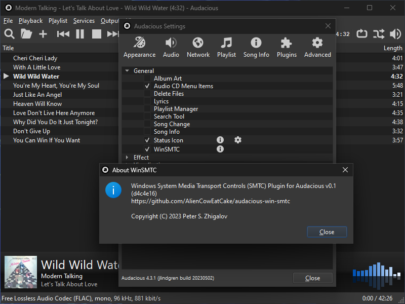

# Windows System Media Transport Controls (SMTC) Plugin for Audacious

## Description

This is a general plugin for the [Audacious audio player](https://audacious-media-player.org/). This plugin integrates Audacious audio player with Windows 10/11 System Media Transport Controls (SMTC).

## Installation

1. Download the `win-smtc-qt.dll` file from the [Releases page](https://github.com/AlienCowEatCake/audacious-win-smtc/releases/)
2. Place downloaded `win-smtc-qt.dll` file to the General plugins directory of your Audacious installation (something like `C:\Program Files (x86)\Audacious\lib\audacious\General\`)
3. Launch Audacious

## Screenshots

